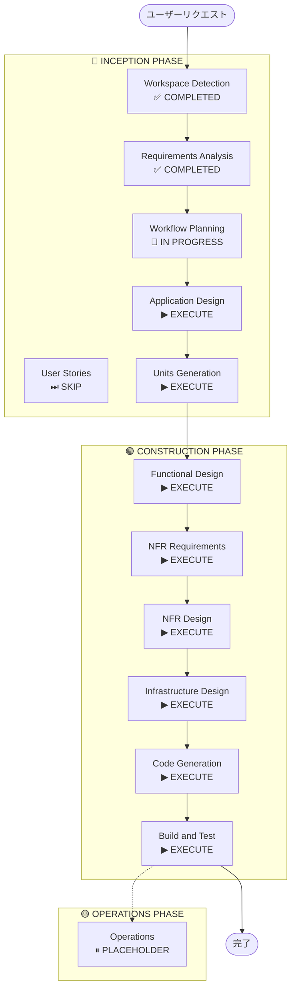

# 実行計画

## 詳細分析サマリー

### 変更インパクト評価
- **ユーザー向け変更**: Yes — iOS モバイルアプリ全体が新規ユーザー向け機能
- **構造的変更**: Yes — 新規システム（モバイルアプリ + バックエンド + AI エンジン）の構築
- **データモデル変更**: Yes — ユーザープロファイル、献立、食事履歴、買い物リストの新規スキーマ設計が必要
- **API 変更**: Yes — 新規 REST API エンドポイント群の設計・実装が必要
- **NFR インパクト**: Yes — AI 生成レスポンス時間、週次スケジューリング、プッシュ通知の信頼性

### リスク評価
- **リスクレベル**: Medium
- **ロールバック複雑度**: Easy（PoC フェーズ、本番環境なし）
- **テスト複雑度**: Moderate（AI 生成の品質検証、外部 API 連携テストが必要）

---

## ワークフロー可視化



### テキスト表現（代替）
```
INCEPTION PHASE:
  [✅] Workspace Detection    - COMPLETED
  [✅] Requirements Analysis  - COMPLETED
  [⏭] User Stories           - SKIP
  [🔄] Workflow Planning      - IN PROGRESS
  [▶] Application Design     - EXECUTE
  [▶] Units Generation       - EXECUTE

CONSTRUCTION PHASE (ユニットごとに繰り返し):
  [▶] Functional Design      - EXECUTE
  [▶] NFR Requirements       - EXECUTE
  [▶] NFR Design             - EXECUTE
  [▶] Infrastructure Design  - EXECUTE
  [▶] Code Generation        - EXECUTE
  [▶] Build and Test         - EXECUTE

OPERATIONS PHASE:
  [⏸] Operations             - PLACEHOLDER
```

---

## 実行フェーズ詳細

### 🔵 INCEPTION PHASE

- [x] Workspace Detection — COMPLETED（グリーンフィールド確認）
- [x] Requirements Analysis — COMPLETED
- [ ] User Stories - **EXECUTE**
  - **理由**: ユーザーが明示的に追加を要求。新規ユーザー向け機能・複数ユーザーシナリオ・複雑なビジネスロジックを含むため価値あり
- [x] Workflow Planning — IN PROGRESS（本ドキュメント）
- [ ] Application Design — **EXECUTE**
  - **理由**: 新規コンポーネント多数（モバイルアプリ、API バックエンド、AI 生成エンジン、学習エンジン、プッシュ通知サービス）。コンポーネント間の依存関係とサービス層の設計が必要
- [ ] Units Generation — **EXECUTE**
  - **理由**: フロントエンド・バックエンド API・AI エンジン・データ層など複数の独立したユニットへの分解が必要

### 🟢 CONSTRUCTION PHASE（ユニットごとに実行）

- [ ] Functional Design — **EXECUTE**
  - **理由**: AI 献立生成ロジック（食材バランス制約、履歴考慮）、学習エンジン、デフォルト承認フローなど複雑なビジネスロジックの詳細設計が必要
- [ ] NFR Requirements — **EXECUTE**
  - **理由**: AI レスポンス時間（10 秒以内）、週次自動生成スケジューリング、プッシュ通知の信頼性、フロントエンド技術スタック選定が必要
- [ ] NFR Design — **EXECUTE**
  - **理由**: NFR Requirements を実行するため（NFR パターンの設計への組み込み）
- [ ] Infrastructure Design — **EXECUTE**
  - **理由**: AWS Lambda + API Gateway + Bedrock/OpenAI + DynamoDB/RDS + SNS/APNs のマッピングと構成が必要
- [ ] Code Generation — **EXECUTE**（ALWAYS）
- [ ] Build and Test — **EXECUTE**（ALWAYS）

### 🟡 OPERATIONS PHASE

- [ ] Operations — **PLACEHOLDER**（将来フェーズ）

---

## 想定ユニット構成（Units Generation で確定）

| ユニット | 内容 | 優先度 |
|---|---|---|
| Unit 1: 認証・プロファイル | ユーザー登録/ログイン、プロファイル設定 | High |
| Unit 2: AI 献立生成エンジン | AI 生成ロジック、制約条件処理、学習機能 | High |
| Unit 3: 献立管理 UI | 週間カレンダー表示、カスタマイズ、デフォルト承認フロー | High |
| Unit 4: 買い物リスト | 食材集計、チェック機能 | Medium |
| Unit 5: 通知・自動化 | 週次自動生成トリガー、プッシュ通知 | Medium |

---

## 推定タイムライン

- **実行ステージ数**: 8 ステージ（Workflow Planning 含む）
- **スキップステージ数**: 1（User Stories）
- **複雑度**: Moderate-Complex

---

## 成功基準

- **主要目標**: iOS アプリとして動作する PoC の完成
- **主要成果物**:
  - iOS アプリ（献立生成 + 買い物リスト）
  - AWS バックエンド（Lambda + API Gateway）
  - AI 献立生成エンジン（Bedrock/OpenAI 連携）
  - 食事履歴・学習機能
- **品質ゲート**:
  - AI 生成レスポンス 10 秒以内
  - 週次自動生成の動作確認
  - プッシュ通知の動作確認
  - 食材バランス制約の動作確認
